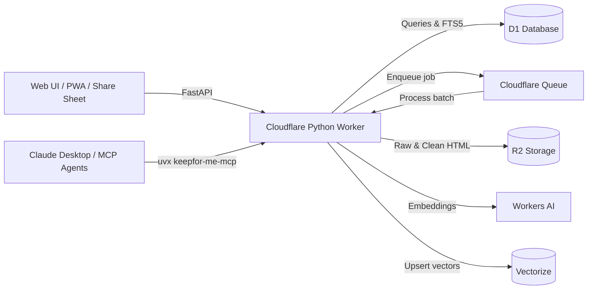

# Keepfor.me

A thin, fast read-it-later and personal library application running entirely on Cloudflare Python Workers, D1 SQLite with FTS5, Vectorize, R2, and the Model Context Protocol (MCP).

---

## Features

- **Four Core Jobs**: Capture, Store, Search, and Share with AI Agents.
- **Python Edge Runtime**: Powered by FastAPI on Cloudflare Python Workers (Pyodide).
- **Installable PWA**: Add to Home screen on Android/iOS, with a Web Share Target so **Share → Keepfor.me** appears in the system share sheet from any app.
- **Distraction-Free Reader**: Customizable themes (Light, Sepia, Dark), fonts (Sans, Serif, Mono), and font sizes.
- **Hybrid Search**: Reciprocal Rank Fusion (RRF) combining D1 FTS5 BM25 keyword matching and Vectorize semantic embeddings (`bge-base-en-v1.5`). FTS and embedding calls run concurrently, and the vector path is time-bounded so a slow AI binding degrades to keyword-only instead of hanging.
- **Resilient Content Extraction**: Automated body parsing via `trafilatura` with OpenGraph metadata fallback so bookmarks are never lost. Browser-identical request headers plus a reader-proxy fallback recover many bot-walled (HTTP 403) origins.
- **Visible Extraction State**: Every item shows `Extracting…`, content, or a **failed reason** (e.g. `HTTP 403`) rather than silently stalling. Bulk imports fan out through the queue, never blocking the request.
- **Dual Snapshots in R2**: Raw original HTML snapshot (`raw.html`) and sanitized reader HTML (`clean.html`).
- **Zero-Config Single-Tenant Lock**: First registration automatically claims admin ownership and locks out external signups.
- **Model Context Protocol (MCP)**: Native `/api/mcp` endpoint and standalone `uvx keepfor-me-mcp` CLI for Claude Desktop and Cursor.
- **Instant Browser Capture**: Drag-and-drop JavaScript bookmarklet and unpacked Manifest V3 extension.
- **Import & Export**: Ingest Pocket, Instapaper, Omnivore, and browser bookmark exports (Netscape HTML & CSV). Chrome folder names are preserved as tags.
- **Mobile-First UI**: Bottom tab bar and tag chip strip on phones, ≥32px touch targets, no horizontal overflow down to 360px.

---

## Architecture Overview



### Extraction lifecycle

Saving a URL inserts the row with `status='queued'` and enqueues a job; the queue
consumer fetches, extracts, stores snapshots, and flips it to `ok` or `failed` with
a reason. Failures are always visible in the UI and reader.

Two deliberate design choices:

- **No queue binding → extract inline.** Local dev and tests have no queue
  consumer, so `save_item` extracts synchronously rather than leaving items stuck
  in `queued` forever.
- **Bulk imports never run inline.** A 900-bookmark import would issue thousands of
  D1 writes inside one request; instead it fans out as queue messages of 25
  bookmarks, or a background task when no queue is bound.

If messages are ever lost, **Settings → Re-queue stuck items** re-sends jobs for rows
stuck in `queued` (skips fresh rows so live messages aren't duplicated).

---

## Deployment

### 1. Prerequisites
- Node.js 20 or newer and npm
- uv 0.12.3 or newer
- Cloudflare account with Workers, D1, R2, Vectorize, and Queues enabled
- Custom domain: `keepfor.me` (or standard `*.workers.dev` subdomain)

### 2. Provision Cloudflare Resources

Run the following commands once to create your D1 database, R2 bucket, Vectorize index, and Queue:

```bash
# 1. Create D1 Database
npx wrangler d1 create keepfor-me-db
# Copy the returned database_id into wrangler.jsonc

# 2. Create R2 Bucket
npx wrangler r2 bucket create keepfor-me-bucket

# 3. Create Vectorize Index (768 dimensions for bge-base-en-v1.5)
npx wrangler vectorize create keepfor-me-index --dimensions=768 --metric=cosine

# 4. Create Queue
npx wrangler queues create keepfor-me-queue
```

### 3. Apply Database Migrations

Apply the initial schema (tables, FTS5 virtual table, indexes):

```bash
npx wrangler d1 migrations apply keepfor-me-db --remote
```

For local testing:
```bash
npx wrangler d1 migrations apply keepfor-me-db --local
```

### 4. Deploy

PyWrangler bundles the Python dependencies declared in `pyproject.toml`.

```bash
# Always dry-run first and check the "Total (N modules)" row: the deploy
# hard-fails if the bundle exceeds 64 MiB.
uvx --from workers-py pywrangler deploy --dry-run

uvx --from workers-py pywrangler deploy
```

A healthy bundle is roughly **52,000 KiB / ~4,500 modules**. If `.venv-workers/`
paths appear in the module table, the build venv is being bundled and the deploy is
one dependency bump away from failing.

Once deployed, visit your domain (e.g., `https://app.keepfor.me` or
`https://keepfor-me.<your-subdomain>.workers.dev`). The first user to register
automatically becomes the admin and locks public registration.

### 5. Custom Domain

`wrangler.jsonc` declares a route for `app.keepfor.me`. Create the DNS record once
(Cloudflare dashboard → **DNS → Add record**):

| Type | Name | Content | Proxy |
|---|---|---|---|
| `A` | `app` | `192.0.2.1` | Proxied (orange cloud) |

The Worker route matches before the IP is ever contacted, so the placeholder
address is fine. `workers_dev` is left enabled so the `*.workers.dev` URL keeps
working.

---

## Connecting Claude Desktop & AI Agents (MCP)

Keepfor.me provides a full Model Context Protocol server exposing 6 tools:
1. `save_url`: Save any webpage to your library.
2. `search_library`: Hybrid search across text and meaning.
3. `get_item`: Read full clean text/markdown and metadata.
4. `list_items`: Paginated browse of recent items.
5. `tag_item`: Add or remove tags.
6. `delete_item`: Remove items and clean up vectors.

### Setup Claude Desktop

1. Go to **Settings & API** in your Keepfor.me UI.
2. Click **Generate Token** to create a Personal Access Token (`kfm_live_...`).
3. Add the server to your `claude_desktop_config.json`:

```json
{
  "mcpServers": {
    "keepfor-me": {
      "command": "uvx",
      "args": [
        "keepfor-me-mcp",
        "--url", "https://app.keepfor.me",
        "--token", "kfm_live_YOUR_TOKEN_HERE"
      ]
    }
  }
}
```

---

## Browser & Mobile Capture

### 1. Phone (PWA + Share Sheet) — Android/iOS
1. Open your domain in Chrome and choose **Add to Home screen** (or **Install app**).
2. To save from anywhere, use **Share → Keepfor.me** from any app — a prefilled save
   sheet opens, and after saving, one system-back swipe returns you to where you were.

### 2. Drag-and-Drop Bookmarklet (desktop)
Go to **Settings** and drag the **Keepfor.me** button to your browser's bookmarks
bar. Click it on any page to open a quick-save dialog.

> Bookmarklets always show a generic globe icon. To get the app icon: bookmark any
> page on your domain, edit that bookmark, paste the copied code (Settings →
> **Copy code**) as its URL, and name it `Keepfor.me`.

### 3. Browser Extension (Manifest V3)
1. Open Chrome/Brave/Edge and navigate to `chrome://extensions/`.
2. Enable **Developer mode** (top right).
3. Click **Load unpacked** and select the `keepfor.me/browser-extension` folder.
4. Click the extension icon, enter your Worker URL and PAT token once in Settings
   (`⚙️`), then save any tab with `Alt+S`.

---

## Local Development & Testing

Install the project and its test dependencies, then run the pytest suite:

```bash
python3 -m pip install -e . pytest pytest-asyncio pytest-cov httpx
python3 -m pytest tests/ -q
```

Run pytest **from the repo root** — `src` resolves as a namespace package only
when the root is on `sys.path`.

Lint and format exactly as CI does (bare `ruff check .` uses different rules and
will pass on things CI rejects):

```bash
ruff check src/ tests/ --select=E,W,F,I,N
ruff format --check src/ tests/
```

To run the local Worker preview with its Python dependencies:

```bash
uvx --from workers-py pywrangler dev
```

Local dev has no queue consumer, so saved links extract inline and show content
immediately.

### Performance notes

Cold starts dominate perceived latency on Python Workers: page loads sit around
250ms warm but can spike past 1.5s when an isolate boots. Two things keep the
import graph small — heavy article parsers (`trafilatura`, `bs4`, `lxml`) are
imported lazily inside the extraction code, and search runs its D1 and AI calls
concurrently. A regression test asserts the parsers stay out of the request import
path.

---

## License

MIT License. Open source and built for speed.
