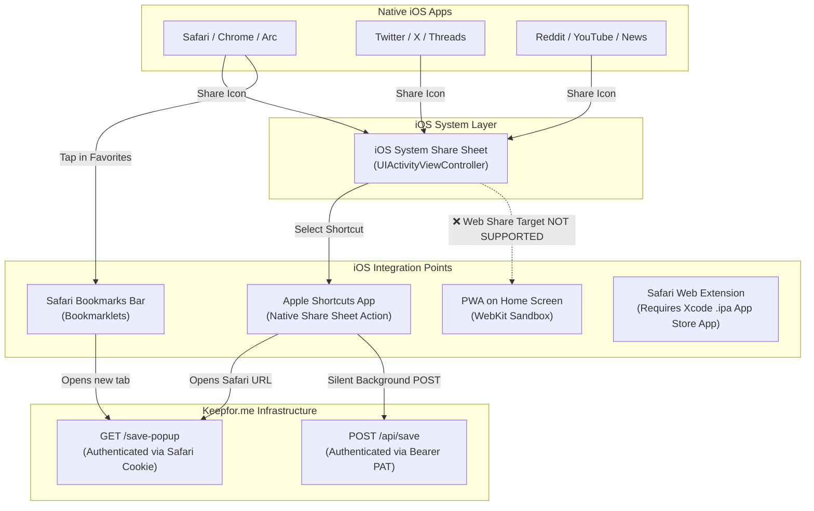
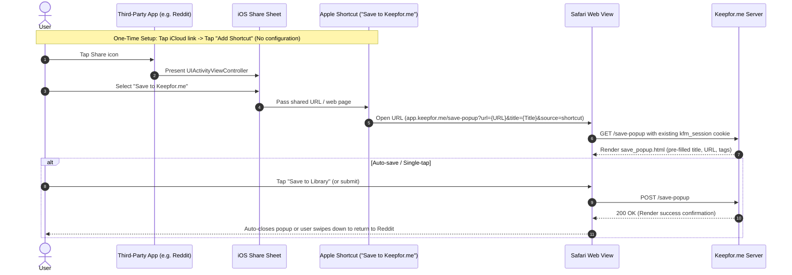
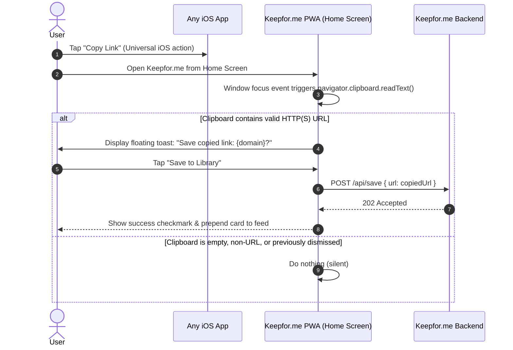
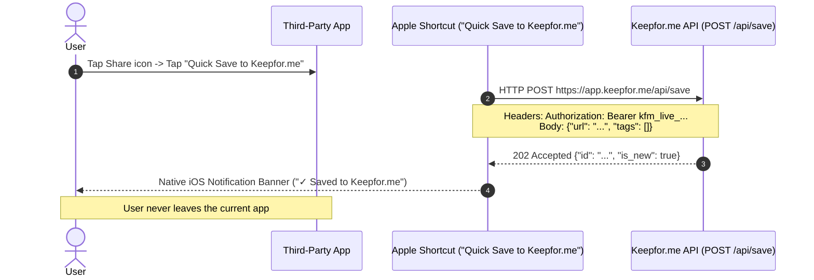

# iOS Bookmarking & Share Architecture Specification

This specification defines the architecture, platform constraints, user experience models, and technical implementation for saving bookmarks to Keepfor.me on iOS from both mobile browsers (Safari, Chrome) and native third-party apps (Twitter/X, Reddit, YouTube, News, Slack, etc.).

---

## 1. Executive Summary & Problem Definition

### The Context
Keepfor.me is a read-it-later and personal library service deployed as a Cloudflare Python Worker. On desktop, users capture articles via a browser extension or a drag-and-drop bookmarklet. On Android, installing the Keepfor.me Progressive Web Application (PWA) leverages the W3C **Web Share Target API** (`share_target` in `manifest.webmanifest`), seamlessly registering Keepfor.me into the native Android system share sheet.

### The iOS Challenge
On iOS, the situation is completely different:
1. **Apple WebKit does not support Web Share Target**: Even when a user installs Keepfor.me to their iOS Home Screen, Apple's WebKit runtime completely ignores `share_target`. The PWA *cannot* receive shares from the system share sheet (`UIActivityViewController`).
2. **Strict Application Sandboxing**: iOS enforces rigid isolation between apps. Third-party apps (Reddit, Twitter, etc.) cannot communicate directly with web apps or browsers outside of system-mediated activities.
3. **The Non-Technical Usability Barrier**: Non-technical users expect saving to work with 1–2 taps like native apps (e.g., Pocket, Raindrop, Apple Notes). Confronting non-technical users with developer concepts such as *Personal Access Tokens (PATs)*, *Bearer headers*, or *JavaScript snippet editing* results in near-total setup abandonment.

### The Solution Architecture
This specification establishes a two-tiered system for iOS capture:
* **Tier 1: Non-Technical Experience (Zero-Token Setup)**
  * **Option A (Zero-Token Safari Shortcut)**: A 1-tap install Apple Shortcut distributed via iCloud link. It triggers from the iOS Share Sheet across all apps, opens a lightweight Keepfor.me sheet in Safari, and authenticates transparently using the user's existing Safari session cookie (`kfm_session`). **Zero tokens, zero configuration.**
  * **Option B (PWA Smart Clipboard Detection)**: Zero setup required. The user taps "Copy Link" in any app and opens the Keepfor.me Home Screen PWA. The app automatically detects the URL on the clipboard and offers a 1-tap "Save to Library" toast.
* **Tier 2: Power-User Experience (Silent Background Save)**
  * **Direct API Apple Shortcut**: Uses an auto-provisioned or manually configured Personal Access Token to make an HTTP `POST /api/save` request silently in the background, surfacing a native iOS checkmark notification banner without switching apps or opening browser tabs.

---

## 2. iOS Platform Constraints & Architecture



### Apple Platform Realities
* **Web Share Target (Manifest) = Dead End on iOS**: As of WebKit/iOS 18+, Apple does not implement the `share_target` manifest member. PWAs cannot be registered as share targets without a native iOS app container.
* **Safari Web Extensions = Native App Store Required**: iOS 15+ supports Safari Web Extensions (similar to the desktop Manifest V3 extension in `browser-extension/`), but Apple requires them to be compiled in Swift/Xcode, packaged into an `.ipa` container app, and distributed through the Apple App Store or TestFlight.
* **Apple Shortcuts = The Universal Native Bridge**: The Shortcuts app is pre-installed on all iOS devices and integrates directly into `UIActivityViewController`. Shortcuts can receive input from any app and perform network requests or open browser URLs.

---

## 3. Detailed Workflow Specifications

### Workflow 1: Zero-Token Safari Share Sheet Shortcut (Primary Non-Technical Flow)

This is the recommended default method for users who want to save from third-party apps (Reddit, Twitter, etc.) with zero technical setup.



#### Shortcut Construction
* **Input Types Accepted**: URLs, Safari web pages, Text.
* **Action**: `Open URL`:
  ```text
  https://app.keepfor.me/save-popup?url=[Shortcut Input]&title=[Page Title]&source=shortcut
  ```
* **Authentication**: Transparent session cookie (`kfm_session`) already stored in Safari from the user's web login.
* **No Configuration Questions**: The user is never prompted for tokens, base URLs, or passwords during installation.

---

### Workflow 2: Smart Clipboard Detection in PWA (Zero Setup At All)

For users who prefer not to install Apple Shortcuts or use the system share sheet, Keepfor.me provides a zero-setup clipboard workflow.



#### Technical Rules for Clipboard Detection
1. **Trigger Condition**: Executes on `document.addEventListener('visibilitychange')` (when `document.visibilityState === 'visible'`) and `window.addEventListener('focus')`.
2. **Permission Handling**: On iOS Safari/PWA, `navigator.clipboard.readText()` may show a native "Paste" permission prompt if not triggered by direct user interaction. To avoid annoying permission dialogs, the app provides a subtle floating banner:
   ```html
   <div id="clipboard-bar" class="fixed bottom-20 inset-x-4 max-w-md mx-auto bg-slate-900 text-white p-3 rounded-xl shadow-lg flex items-center justify-between z-50">
     <div class="flex items-center space-x-2 truncate">
       <span class="text-xs text-slate-300">Save from clipboard?</span>
     </div>
     <div class="flex items-center space-x-2">
       <button id="clipboard-dismiss" class="text-xs text-slate-400 px-2 py-1">Ignore</button>
       <button id="clipboard-save" class="text-xs bg-blue-600 font-semibold px-3 py-1 rounded-lg">Save</button>
     </div>
   </div>
   ```
3. **Deduplication**: Once a URL is saved or dismissed, its SHA-256 hash or string is stored in `sessionStorage` or `localStorage` key `kfm_last_clipboard_url` to avoid prompting repeatedly for the same link.

---

### Workflow 3: Silent Background Shortcut (Power User Flow)

For users who want zero UI interruption when saving from other apps:



#### Shortcut Actions
1. **Get URLs from Input**: Extracts URL from shared content (handling both raw URLs and mixed text).
2. **Get Contents of URL**:
   * **URL**: `https://app.keepfor.me/api/save`
   * **Method**: `POST`
   * **Request Body**: `JSON` with key `url` = `[URL]`
   * **Headers**: `Authorization` = `Bearer [User_PAT]`
3. **Show Notification**: Displays a native iOS banner with title *"Keepfor.me"* and body *"Saved to your library!"*.

---

### Workflow 4: Safari Bookmarklet (Mobile Safari Browser Fallback)

For users browsing directly in mobile Safari who do not wish to use the Share Sheet:
* A JavaScript snippet stored in Safari Favorites:
  ```javascript
  javascript:(function(){
    var u=encodeURIComponent(window.location.href);
    var ti=encodeURIComponent(document.title);
    window.open('https://app.keepfor.me/save-popup?url='+u+'&title='+ti,'_blank');
  })();
  ```
* **Limitation on iOS**: Cannot be executed outside of Safari (will not work in Reddit, Twitter, YouTube, etc.). Adding a bookmarklet on iOS requires manually creating a dummy bookmark, editing its properties, and replacing the URL with the JavaScript string.

---

## 4. Backend & API Requirements

### Robust URL Normalization in `POST /api/save`
Native iOS apps frequently share text that combines titles, notes, and tracking parameters with the URL (e.g., Twitter shares: `"Interesting read: https://example.com/article?utm_source=twitter"`).

`POST /api/save` must normalize the incoming URL string identically to the logic in `share_target`:

```python
# keepfor/app.py - api_save_item
target = str(body.url).strip()
if not target.startswith(("http://", "https://")):
    match = re.search(r"https?://\S+", target)
    if match:
        target = match.group(0).rstrip(").,!?\"'")
```

### Save Popup Enhancements for iOS (`templates/save_popup.html`)
1. **Safe Area Insets**: Must enforce `padding-bottom: max(1.5rem, env(safe-area-inset-bottom))` to prevent iPhone home indicators from obscuring buttons.
2. **Font Size Floor**: All form inputs must maintain `font-size: 16px` to prevent iOS Safari from automatically zooming the viewport when focusing an input.
3. **Auto-Close / Swipe-Back**: In Safari popup mode, upon successful submission, offer a clear "Return to your app" button and trigger `window.close()` with fallback to `/`.

---

## 5. User Onboarding & Settings UI Redesign

In `templates/settings.html`, the browser capture section will be restructured to feature mobile and iOS prominently:

```
┌────────────────────────────────────────────────────────────────────────┐
│ 📱 iPhone & iPad Quick Sharing                                         │
│ Save links directly from Twitter, Reddit, YouTube, or Safari.          │
│                                                                        │
│ ┌──────────────────────────────────┐  ┌──────────────────────────────┐ │
│ │ ⚡ 1-Tap iOS Shortcut (Zero Setup)│  │ 📋 Smart Clipboard in PWA    │ │
│ │ Adds "Save to Keepfor.me" to your │  │ Copy a link anywhere, open   │ │
│ │ iOS Share Sheet. No tokens needed.│  │ Keepfor.me, and tap Save.    │ │
│ │                                  │  │                              │ │
│ │ [ 📲 Add to Apple Shortcuts ]    │  │ [ Add PWA to Home Screen ]   │ │
│ └──────────────────────────────────┘  └──────────────────────────────┘ │
│                                                                        │
│ Need silent background saving? [Set up Background Shortcut (Power User)]│
└────────────────────────────────────────────────────────────────────────┘
```

---

## 6. Edge Cases & Resilience

| Scenario | Behavior / Mitigation |
|---|---|
| **Expired or Missing Safari Session** | The user has logged out or their cookie expired. The `/save-popup` endpoint detects no user and redirects with `303` to `/auth/login?next=/save-popup?...`. Upon login, they are returned immediately to save the item. |
| **App Shares Mixed Text and URL** | Regex extraction (`re.search(r"https?://\S+", text)`) strips lead text and trailing punctuation so the URL parser never fails. |
| **Duplicate Submissions** | Deduplication in `save_item` returns HTTP `200` with `is_new: false` instead of creating redundant rows or failing with 500. |
| **Offline / Airplane Mode** | If an Apple Shortcut fails to reach `POST /api/save`, iOS Shortcuts natively catches the network timeout and alerts the user that the server was unreachable. |
| **Private / Incognito Browsing** | If the user opens the shortcut in Safari Private Browsing where the session cookie is absent, they are prompted to sign in once. |

---

## 7. Verification & Testing Matrix

### Automated Test Cases
* Unit test: `POST /api/save` accepts pure URLs (`https://example.com/story`).
* Unit test: `POST /api/save` extracts valid URLs from mixed share strings (`"Story title https://example.com/story shared via app"`).
* Regression test: Unauthenticated `GET /save-popup` redirects to `/auth/login` with safe `_safe_next` parameter.
* Regression test: Authenticated `GET /save-popup` returns HTML form with pre-filled parameters.

### Manual Device Verification
1. **iOS Share Sheet from Third-Party Apps**:
   * Open Twitter/X, Reddit, or YouTube on an iPhone.
   * Tap Share → select "Save to Keepfor.me" shortcut.
   * Verify Safari sheet slides up with URL and Title pre-filled.
   * Tap Save → confirm item is ingested and visible in the library.
2. **PWA Clipboard Detection**:
   * Copy a link in mobile Safari or Notes.
   * Switch to Keepfor.me installed on Home Screen.
   * Confirm the clipboard prompt appears and saves the item in 1 tap.
