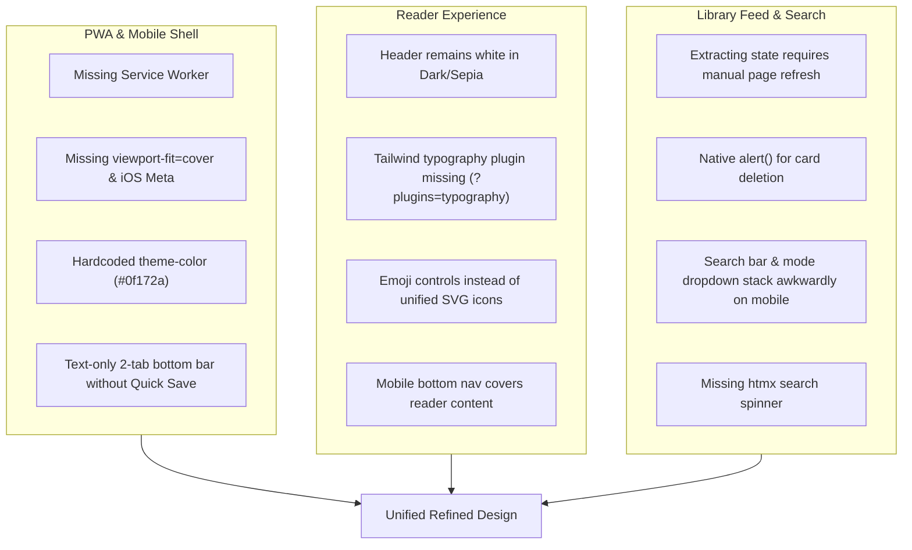

# UI/UX & PWA Refinement Plan

Comprehensive analysis, design architecture, and phase-by-phase implementation plan for refining Keepfor.me's web and progressive web application (PWA) experience.

---

## 1. Executive Summary & Assessment

**Keepfor.me** is built on a fast, minimal stack: FastAPI deployed to Cloudflare Python Workers, server-rendered Jinja2 templates, Tailwind CSS via CDN, and htmx for dynamic interactions. 

### Strengths
* **Sub-millisecond client boot**: Zero client-side JavaScript framework bloat; fast initial HTML delivery.
* **Focused utility**: Streamlined workflows for saving links, searching, reading, token administration, and data portability.
* **Lightweight Reader**: Reader view already features basic font switching (Sans/Serif/Mono), size controls, and themes (Light/Sepia/Dark).
* **Cloudflare Worker compliance**: Self-contained assets (dynamic icons, SVG favicon) with zero static asset bundle overhead.

### Key Opportunities for Refinement
1. **PWA Standalone Experience**: Currently lacks a service worker, `viewport-fit=cover`, iOS standalone meta tags, and dynamic theme-color synchronization.
2. **Mobile Navigation Ergonomics**: Bottom bar only provides two plain-text links with no thumb-accessible "+ Save Link" action. Centered modals are unsuited for mobile touchscreens.
3. **Reader Immersion**: The global header and mobile bottom bar do not adapt to Sepia/Dark mode, causing a stark white glare when reading in dark environments. Missing prose typography plugins and reading progress indicators.
4. **Library Feed & Micro-interactions**: Plain cards, intrusive browser alerts for deletion, lack of real-time or auto-polling visual feedback for items in `queued`/`fetching` state, and stacked mobile search controls.

---

## 2. Detailed Findings & Gap Analysis

### A. PWA & Mobile Ergonomics
* **Missing Service Worker**: While `/manifest.webmanifest` and PWA icons exist, no Service Worker is registered. Modern mobile browsers require a service worker to trigger full standalone installation criteria and support offline/intermittent connection resilience.
* **Safe-Area Clipping**: Viewport tag `<meta name="viewport" content="width=device-width, initial-scale=1.0">` omits `viewport-fit=cover`. On iOS devices with home indicators, notches, or Dynamic Island, `env(safe-area-inset-*)` values are zero without `viewport-fit=cover`.
* **iOS Web App Meta**: Standalone iOS PWAs require `<meta name="apple-mobile-web-app-capable" content="yes">`, `<meta name="apple-mobile-web-app-status-bar-style" content="black-translucent">`, and `<meta name="apple-mobile-web-app-title" content="Keepfor.me">`.
* **Dynamic Theme Color**: `<meta name="theme-color" content="#0f172a">` is fixed to dark slate even on light pages. In dark or sepia reader mode, the mobile browser URL/status bar remains mismatched.
* **Native Touch Interactions**: Lacks `-webkit-tap-highlight-color: transparent` (causes grey tap flashes) and `overscroll-behavior-y: contain` (prevents whole-page bouncing inside standalone PWAs).

### B. Navigation & Modal Layout
* **Mobile Bottom Bar**: Currently renders `grid grid-cols-2` with text links (`Library` and `Settings`). Missing a prominent center "+" quick-add action.
* **Reader Collision**: The mobile navigation bar remains pinned at the bottom when reading an article, distracting the reader and taking up vertical space.
* **Save Modal / Drawer**: The save dialog is a fixed centered modal box. On mobile, this is awkwardly positioned and easily blocked by the virtual keyboard. A responsive bottom sheet drawer is the native mobile standard.
* **Share Target (`/share`)**: PWA Web Share Target renders `save_popup.html` inside a desktop card. It should adopt a full-width bottom sheet layout on mobile.

### C. Reader Experience
* **Theme Bleed**: When toggling to `.theme-dark` or `.theme-sepia`, only the `body`, `article`, and `.reader-card` update. The `<header>` and `#mobile-nav` remain stark white (`bg-white/90`), breaking immersion.
* **Prose Styling**: The reader body uses `
`, but the Tailwind CDN script in `templates/base.html` loads bare Tailwind without the typography plugin (`https://cdn.tailwindcss.com?plugins=typography`). As a result, headings, tables, blockquotes, code blocks, and lists do not receive Tailwind's prose styling.
* **Reader Controls**: The font and theme buttons use plain text and emojis (`☀️`, `📜`, `🌙`, `A-`, `A+`). Replacing these with minimalist SVG icons elevates the visual aesthetic.
* **Reading Progress**: Adding an unobtrusive top scroll progress bar provides feedback on long-form articles.

### D. Library Feed & Search
* **Extraction Status Feedback**: Items in `status == 'queued'` or `'fetching'` display `Extracting...`, but require a full manual page reload to see when extraction finishes. An htmx polling trigger (`hx-trigger="load delay:4s, every 4s"`) on extracting cards enables automatic updates.
* **Search UX**: The search input and search mode select element stack awkwardly on smaller screens. A subtle htmx-indicator spinner provides instant feedback that search results are streaming in.
* **Card Aesthetics**: Favicons with single-letter fallbacks, tag pill badges, and reading time can be aligned with consistent padding and typography hierarchy.

---

## 3. Implementation Roadmap

### Phase 1: PWA & Shell Foundations
1. **Viewport & Meta Tags (`templates/base.html`)**:
   * Add `viewport-fit=cover` to `<meta name="viewport">`.
   * Add iOS standalone tags (`apple-mobile-web-app-capable`, `apple-mobile-web-app-status-bar-style`, `apple-mobile-web-app-title`).
   * Add smooth touch CSS (`-webkit-tap-highlight-color: transparent`, `overscroll-behavior-y: contain`).
2. **Dynamic Theme Color**:
   * Update `<meta name="theme-color">` to match system light/dark and reader mode states (Light: `#f8fafc`, Sepia: `#fbf0d9`, Dark: `#0f172a`).
3. **Lightweight Service Worker**:
   * Serve a lightweight `sw.js` endpoint from `src/app.py` (served with `Service-Worker-Allowed: /`) to satisfy PWA installability requirements and cache core navigation shell without inflating deployment bundle size.
   * Register the service worker in `templates/base.html`.

### Phase 2: Navigation & Save Drawer
1. **Mobile Bottom Navigation Bar**:
   * Redesign mobile bottom nav with 3 touch targets:
     * **Library** (SVG book/library icon + label)
     * **Quick Save** (elevated center "+" action button)
     * **Settings** (SVG gear/cog icon + label)
   * Automatically hide the bottom nav on `reader.html` to maximize reading real estate.
2. **Responsive Save Sheet / Modal**:
   * Desktop: Centered modal with `S` keyboard shortcut.
   * Mobile: Smooth bottom sheet drawer sliding up from the bottom thumb zone with auto-focused URL input and safe-area padding.
3. **PWA Share Target Sheet (`templates/save_popup.html`)**:
   * Convert popup to a clean edge-to-edge card on mobile with immediate save and close actions.

### Phase 3: Reader View Refinement
1. **Typography Plugin**:
   * Update Tailwind CDN in `templates/base.html` to `https://cdn.tailwindcss.com?plugins=typography`.
2. **Theme Consistency**:
   * Ensure Dark and Sepia themes apply to the header, borders, and reader controls seamlessly.
3. **Refined Controls & Reading Bar**:
   * Replace emojis with clean SVG icons for Light, Sepia, and Dark themes.
   * Add a slim scroll reading progress bar pinned to the top of the viewport.

### Phase 4: Library Feed & Search Polish
1. **Live Extraction Polling**:
   * Add `hx-get="/items/{id}/card"` or polling swap on extracting cards so cards automatically update to completed state when worker finishes ingestion.
2. **Search Header & Loading Indicator**:
   * Reorganize search bar and search mode selector to align cleanly on all screen sizes.
   * Add an animated SVG loading spinner triggered via htmx `htmx-request` class.
3. **Card Micro-polish**:
   * Refine favicon rendering, reading time pill, tag styling, and touch action hit areas.

---

## 4. Verification & Constraints Checklist

* [ ] `python3 -m pytest tests/ -q` passes without regressions.
* [ ] `ruff check src/ tests/ --select=E,W,F,I,N` passes.
* [ ] `ruff format --check src/ tests/` passes.
* [ ] Bundle size check: verify zero static asset inflation; deploy dry-run stays within the 58,000 KiB budget gate.
* [ ] Responsive verification: tested across desktop widths (1200px+), tablet (768px), and mobile (375px/390px with notch safe areas).
